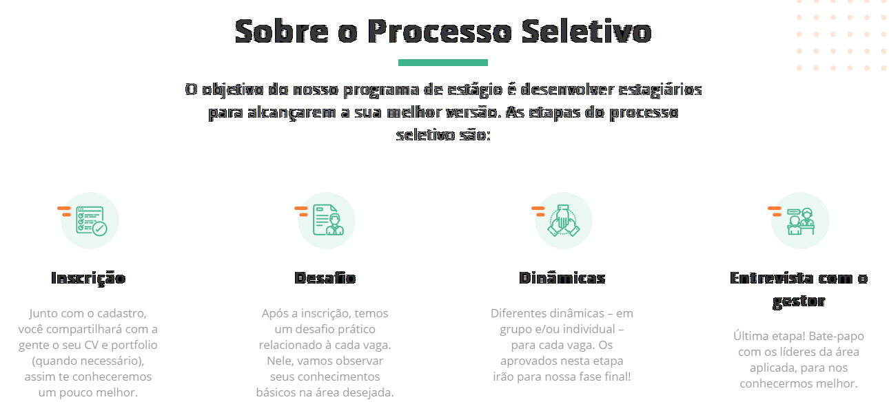

# Desafio Prático para Vaga de Estágio [2023]

Ness desafio prático relacionado à vaga tinha a finalidade de observar meus conhecimentos básicos.

Briefing do desafio: 

Queremos que você programe em html responsivo o layout do arquivo .PSD.

Você deverá fatiar as imagens e programá-lo seguindo o layout do arquivo e as orientações abaixo.:

• A posicionar elementos na página usando o flexbox; 
• A usar as propriedades do flexbox; 
• E pratiquei a <b>responsividade</b> criando um arquivo <b>responsive.css</b>;

## Screenshots

  </img>

  </img>

